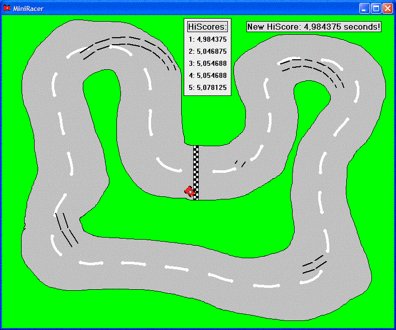



## MiniRacer 2D

### Description

Just a small 2D racing game. Demonstrates use of ImageList, pictures with transparent colors, some calculations on moving objects and some simple file handling. But this is mostly for the fun of it. Try to beat my HiScore.. :)

Under 5 seconds...
 
### More Info
 

             |
---                |---
**Submitted On**   |2003-08-04 17:26:04
**By**             |[Lars Holm Jensen](https://github.com/Planet-Source-Code/PSCIndex/blob/master/ByAuthor/lars-holm-jensen.md)
**Level**          |Intermediate
**User Rating**    |5.0 (25 globes from 5 users)
**Compatibility**  |VB 6\.0
**Category**       |[Graphics](https://github.com/Planet-Source-Code/PSCIndex/blob/master/ByCategory/graphics__1-46.md)
**World**          |[Visual Basic](https://github.com/Planet-Source-Code/PSCIndex/blob/master/ByWorld/visual-basic.md)
**Archive File**   |[MiniRacer\_162414842003\.zip](https://github.com/Planet-Source-Code/lars-holm-jensen-miniracer-2d__1-47399/archive/master.zip)

### API Declarations

None actually

